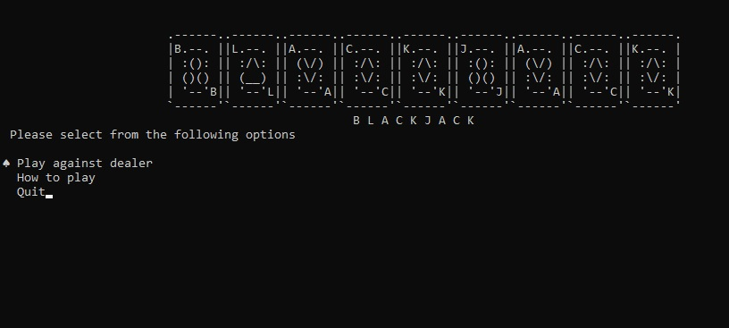
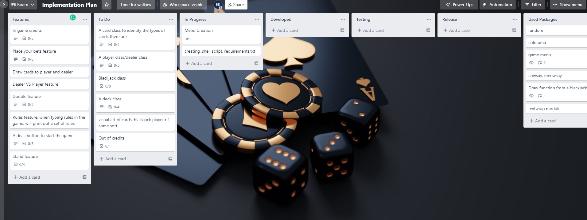
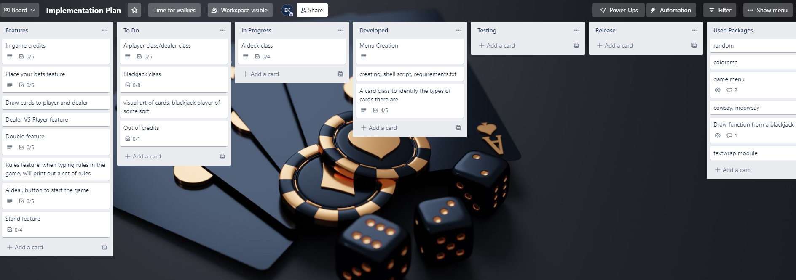
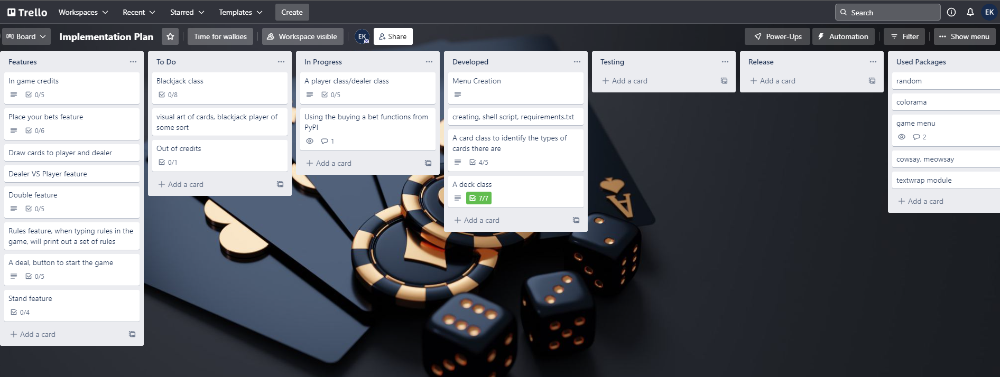
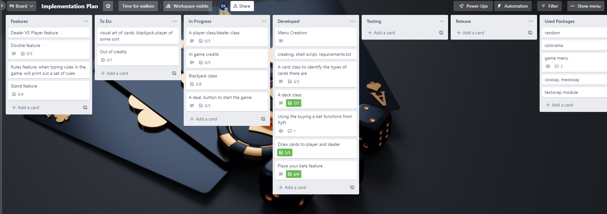
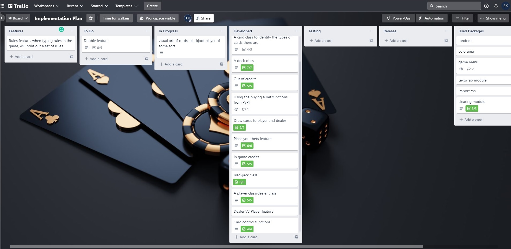

### User Interaction and Experience

The game with the menu screen being display.

It includes a "How to play section", "Quit" and most important "Play against dealer"

### Implementation

##### Day 1

 
The first day of implementation planning, I was able to come up with the following on Trello:
  

Menu creation was on its way, shell scripting, requirement.txt to ensure the game will work from the very beginning of the project and to ensure that every addition that I make, I test on the shell for the changes.
  

##### Day 2

 
The second day of implementation planning, I was able to come up with a menu, created a working shell script that reads requirements.txt and checks if the user has created a virtual environment, and the required packages before running the game. Also created some code for the card class that creates a deck of identifiable cards.
  

#### Day 3
The third day, spent some time creating and completing my deck and card class. As well as adding a PyPI package called 'dealerschoice' and using some of the functions it had to have in game currency. OOP was added to the code and grouped together with methods for everything to be more streamlined, clearer to read and more functional.

### Day 4
The fourth day, was mainly spent around creating a player class and building on some if statement as well as for loops to check the value of each card. Having a bust feature if the player hits over 21. Adding more features as I go along. I think eventually when I have the logic correct, to try and apply some more OOP.

### Day 5
The fifth day, made some great progress today, completed the player vs dealer function, the black jack class, options to rebuy, the stand feature. As will as being able to quit more gracefully without errors showing. Also a clear screen at the end of every game. We also ask the player if they would like to play again and if they select no it will exit the game gracefully.

### Installation Instructions

1. If you do not have Python installed on your computer or OS, please go to [page](https://www.python.org/downloads/) and install Python.
2. Please also install pip onto your computer or OS, please go to [link](docs/implementation_2..jpg)
3. Clone the repository by writing the command line below

   `git clone https://github.com/Erkan-Kaban/TerminalApp.git`

4. From here we need to change into the directory src folder from the cloned repository on our local system by:
   
    `cd src`
5. From here we can run blackjack by executing the shell script by entering the command 

    `./blackjack.sh`
6. From here we check if you've installed the dependecies required and will run the game with prompts.