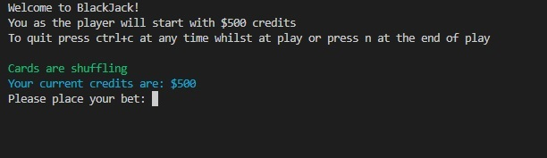

### User Interaction and Experience

The game with the menu screen being display.

It includes a "How to play section", "Quit" and most important "Play against dealer"

Once the player has selected play against dealer they are met with this screen below:

Player is shown what their beginning credits are and have to input a value within their credit limits for the bet.

If you are as lucky as me when you're documenting, on the first draw you might get a blackjack a value of 21 from the first two dealt hands! I made it so you automatically win and don't need to play against the dealer.

When you select h as you can see the game randomly deals you one of the cards, Aces are set too 11 so in this example we busted as we won't over 21.

When you're happy with the value of cards you have, you select s for stand, this automatically puts you up agains the dealer, the dealer deals itself random cards till the value of 17, since 15 is below 17 the dealer dealt one more card and busted in this case by going over 21, making you a winner!

### R3 Full attribution to referenced sources

<u>The referenced resources used for this project are as follows:</u>
  

Rossum, G., 2022. PEP 8 – Style Guide for Python Code | peps.python.org. [online] Peps.python.org. Available at: <https://peps.python.org/pep-0008/> [Accessed 22 September 2022].

Patorjk.com. 2022. Text to ASCII Art Generator (TAAG). [online] Available at: <http://patorjk.com/software/taag/#p=display&f=Cards&t=Blackjack> [Accessed 22 September 2022].

PyPI. 2022. clearing. [online] Available at: <https://pypi.org/project/clearing/> [Accessed 22 September 2022].

PyPI. 2022. pick. [online] Available at: <https://pypi.org/project/pick/> [Accessed 22 September 2022].

PyPI. 2022. colorama. [online] Available at: <https://pypi.org/project/colorama/> [Accessed 22 September 2022].

### R4 Link to source control repository

[Click here for repository](https://github.com/Erkan-Kaban/TerminalApp)

 

### R5 The style guide or styling convention adhered to:

<u>PEP8 - Style Guide for Python Code</u>
  

### R6 Features

### <u>Hit Feature</u>

The hit feature allows users to draw another single card to add to their hands. When the user types in the "h" letter. The cards are calculated to the player's total hand value. The player's hand is also shown to the user to decide what to do next. The hit feature is active inside a while loop that keeps track of the user's total card hand value. As long as the value of the user's total card hand value doesn't go over 21, the user keeps getting asked if they would like to hit (take another card).

Variable player_hand_total is inside the main while loop to ensure at every new hand we're dealt, the variable is set to the current card hand total at play. In addition, this variable is in a while loop condition where the player_hand_total < 21. This loop allows the game at play to keep going till the user reaches 21 or over. When the player's card count adds over 21, we place an if statement. If the hand total is over 21. We print the player has lost and a break to break out of the while loop. The user can write whatever they like instead of 'h.' Still, the program constantly loops back to the question, "Would you like to hit(another card) or stand(stay) (h/s)?" no matter if they input numbers or letters, it won't provoke an error. It will simply keep asking them to input (h/s). 

### <u>Stand Feature</u>
The stand feature works in the same area as the hit feature. It works with the hit feature, so the user has the option on the same turn to hit or stand. With the stand feature, once the user inputs the 's' key, we call the dealer function outside the while loop. The dealer deals cards themselves till they reach a total value of 17 or over. We then capture that total into a variable named dealer_hand_total. We then place a series of if statements that compare the variable player_hand_total and the dealer_hand_total. If the player's hand total is more than the dealer's total, we print that "You win!!" and calculate their winnings, add it to their total credits, and break out of the loop. If the dealer also goes over 21, we check if they've busted. We also check if the player hand total and dealer hand total are the same. In this case, we "push" credit to be refunded and break out of the loop. Otherwise, all other options are FALSE the dealer wins.

### <u>Rebuy Feature</u>
For the rebuy feature, we check at the end of every game played with an if statement. For example, we are checking if the user's credit has reached 0 or not. Once this condition is met in the if statement, we place a while loop and use the try/except combination. We wait for input with a message stating that they've run out of credits and give the player the option to specify how many credits they would like to rebuy. Every time the user inputs something invalid (ValueError), we print and ask them to input a correct amount of $1 to $1000. Since we're in a while loop, the program will keep asking until the user inputs something valid. Once the player has inputted a valid amount (1- 1000), we break out of the loop and save their new amount into a new initialized amount they've inputted into the game.

### <u>Bet Feature</u>

With the bet feature, we used an external package from PyPI called CardGame, specifically the money.py module. Inside the money.py we have a function called "bet" that we've inherited from our class. When we call this function, we ask the user to place a bet. This bet function checks if the amount is not above or below the number of credits the player is holding, so it will raise a "That is not a valid bet. Please try again." if the user doesn't place a valid bet. Otherwise, it will get saved into self.bet, where we save that into our local variable called bet_amount. Depending on what unfolds, we use this bet amount to calculate winning or losing for the player.

### <u>Main Menu Feature</u>

The main menu is another imported package from PyPI called "picker" once imported, it allows you to edit what options you'd like. We have a player against the dealer. How to play and quit. The menu uses directional keys on the keyboard to launch the main game or to select how to play or quit. This feature is pretty solid and doesn't have any way for a program to produce errors. We have placed a catching error incase the user does try to ctrl+c, and it will write a message that it's quitting and close the program rather than showing errors.

### Implementation

##### Day 1

 
The first day of implementation planning, I was able to come up with the following on Trello:
  

Menu creation was on its way, shell scripting, requirement.txt to ensure the game will work from the very beginning of the project and to ensure that every addition that I make, I test on the shell for the changes.
  

##### Day 2

 
The second day of implementation planning, I was able to come up with a menu, created a working shell script that reads requirements.txt and checks if the user has created a virtual environment, and the required packages before running the game. Also created some code for the card class that creates a deck of identifiable cards.
  

#### Day 3
The third day, spent some time creating and completing my deck and card class. As well as adding a PyPI package called 'dealerschoice' and using some of the functions it had to have in game currency. OOP was added to the code and grouped together with methods for everything to be more streamlined, clearer to read and more functional.

### Day 4
The fourth day, was mainly spent around creating a player class and building on some if statement as well as for loops to check the value of each card. Having a bust feature if the player hits over 21. Adding more features as I go along. I think eventually when I have the logic correct, to try and apply some more OOP.

### Day 5
The fifth day, made some great progress today, completed the player vs dealer function, the black jack class, options to rebuy, the stand feature. As will as being able to quit more gracefully without errors showing. Also a clear screen at the end of every game. We also ask the player if they would like to play again and if they select no it will exit the game gracefully.

### Day 6
The sixth day, tied in my blackjack.py program with the main menu, got it all functioning the way I like it, catching every error I can think of, also worked on my readme a little bit and tried to implement some error catching.

### Day 7
The seventh day, my main focus was on grouping all of my code in there own individual functions, to make the code cleaner and easier to read. Added more comments in to the code. Gave each variable and class more meaning and a difference. Worked on Readme etc.

  

## Testing
<table>
    <thead>
    <tr>
    <th>Feature</th>
    <th>Expected Outcome</th>
    <th>Actual Outcome</th>
    <th>Any remaining issues?</th>
    </tr>
</thead>
<tbody>
<tr>
<td></td>
<td><strong>Manual Tests</strong></td>
<td></td>
<td></td>
</tr>
<tr>
<td><strong>Main Menu Feature</td>
<td>Tested out the main menu for any possible ways the user can break the program, they can
ctrl+d to cause errors. Created a try block to catch a user from doing that and when caught
to let the user know with a message "Shutdown requested...exiting" before closing down.</td>
<td>Nil</td>
<td>Nil</td>
</tr>
<tr>
<td><strong>Stand Feature</strong></td>
<td>As expected allows the user to only be able to select the stand option only if they enter the key 's' and press enter, the program will not accept any other kind of input unless the user chooses another option which is too hit by pressing the 'h' key, keeps asking the user to enther h or s for this feature. </td>
<td>As expected</td>
<td>Nil</td>
</tr>
<tr>
<td><strong>Hit Feature</strong></td>
<td>The hit feature, just like the stand feature only allows you to enter the letter 'h' on the keyboard and press enter to draw another card, when on this screen the user cannot enter anything else. Just like the stand feature.</td>
<td>As expected</td>
<td>Nil</td>
</tr>
<tr>
<td><strong>Bet Feature</strong></td>
<td>With the bet feature I limited the amounts to what the user currently has as credits, they start off at 500 so as example they cannot bet more than what they currently have. They cannot enter a negative integer. Or a float number, it needs to be a whole number as credits. Will not allow any other characters other than the numbers between what the user has as credits and $1 not including 0 also. </td>
<td>As expected</td>
<td>Nil</td>
</tr>
<tr>
<td><strong>Rebuy Feature</strong></td>
<td>With the rebuy feature, it is as expected, only comes up when the user has run out of funds, and specificies to the user that they can only input a maximum of 1000, does not allow the user to enter any negative integers, floats or characters, only whole numbers between 1 and 1000 as credits. Works as expected, catches anything else the user may enter and replies back for the user to enter something valid. </td>
<td>As expected</td>
<td>Nil</td>
</tr>
<tr>

</tbody>
</table>
 
### Installation Instructions

1. If you do not have Python installed on your computer or OS, please go to [page](https://www.python.org/downloads/) and install Python.
2. Please also install pip onto your computer or OS, please go to [link](docs/implementation_2..jpg)
3. Clone the repository by writing the command line below

   `git clone https://github.com/Erkan-Kaban/TerminalApp.git`

4. From here we need to change into the directory src folder from the cloned repository on our local system by:
   
    `cd src`
5. From here we can run blackjack by executing the shell script by entering the command 

    `./blackjack.sh`
6. From here the script will automatically check for you, if you have installed the necessary dependencies, it will then check if you've created a virtual environment for the game also, once all these needs have been met the main menu will run. The second time around you run the game it won't take as long as you've already made your required virtual environment.